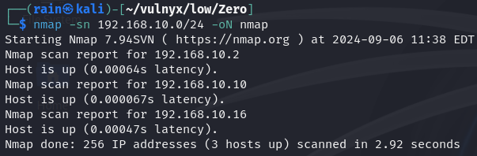
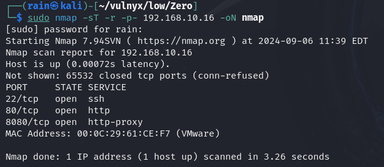
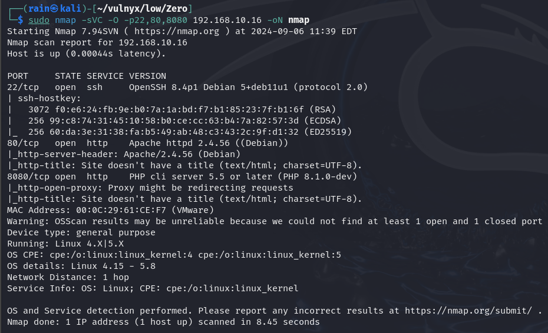
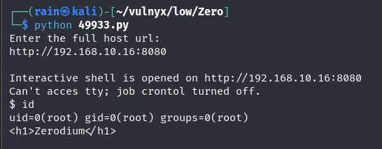

# 环境

来自[Vulny_Zero](https://vulnyx.com/#Zero)

# 信息收集

## 主机发现

```bash
nmap -sn 192.168.10.0/24
```



## 端口扫描

```bash
sudo nmap -sT -r -p- 192.168.10.16
```



## 服务详情

```bash
sudo nmap -sVC -O -p22,80,8080 192.168.10.16
```



## 目录扫描

```bash
dirb http://192.168.10.16
dirb http://192.168.10.16:8080
```

# web渗透

## 已知php8.1.0漏洞拿shell

```bash
searchsploit php 8.1.0 dev
searchsploit -m 49933
```

