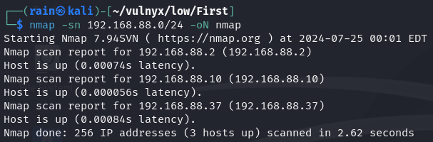
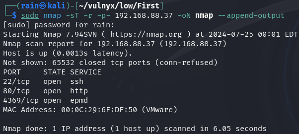
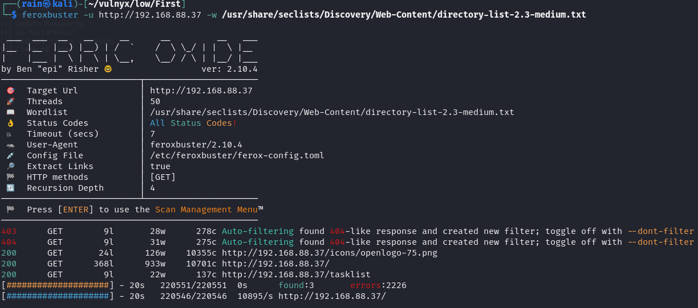
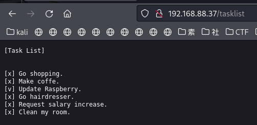
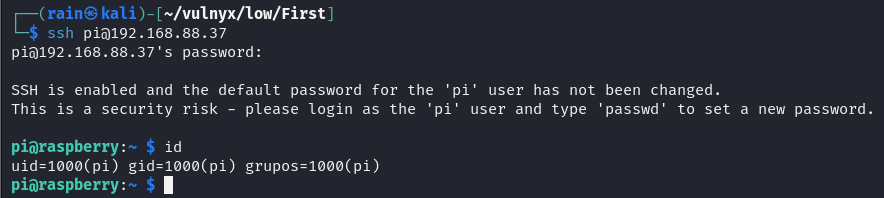

# 环境

来自[vulnyx_First](https://vulnyx.com/#First)

# 信息收集

## 主机发现

```bash
nmap -sn 192.168.88.0/24
```



## 端口扫描

```bash
sudo nmap -sT -r -p- 192.168.88.37
```



## 服务探测

```bash
sudo nmap -sV -sC -O -p22,80,4369 192.168.88.37
```

## 目录扫描

```bash
feroxbuster -u http://192.168.88.37 -w /usr/share/seclists/Discovery/Web-Content/directory-list-2.3-medium.txt
```



# web渗透

## 树莓派默认账号拿shell

访问http://192.168.88.37/tasklist



发现Raspberry(树莓派)，盲猜开发者可能没改默认密码，google查找raspberry的默认账号密码`pi:raspberry`



但是拿到的shell是rbash，受限

```bash
ssh pi@192.168.88.37 -t 'bash --noprofile'
```

